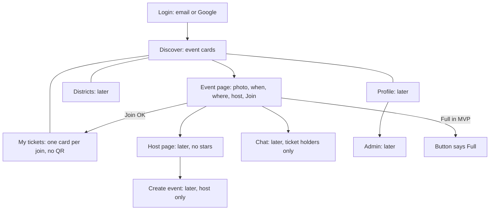
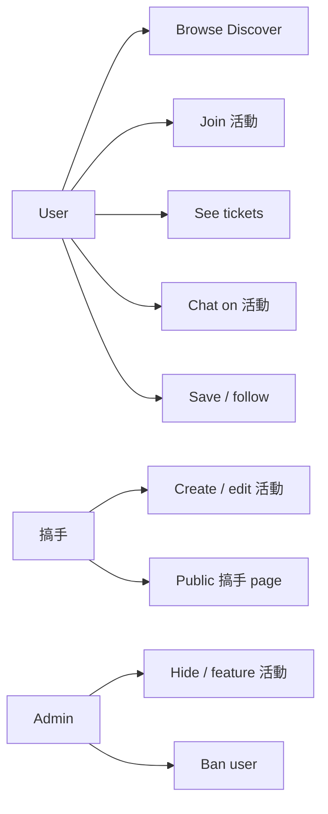
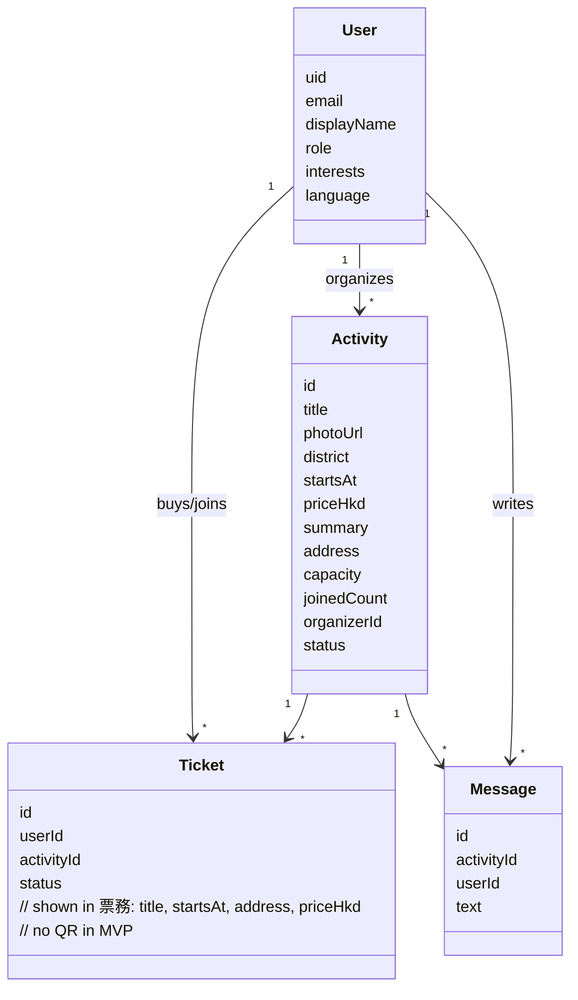
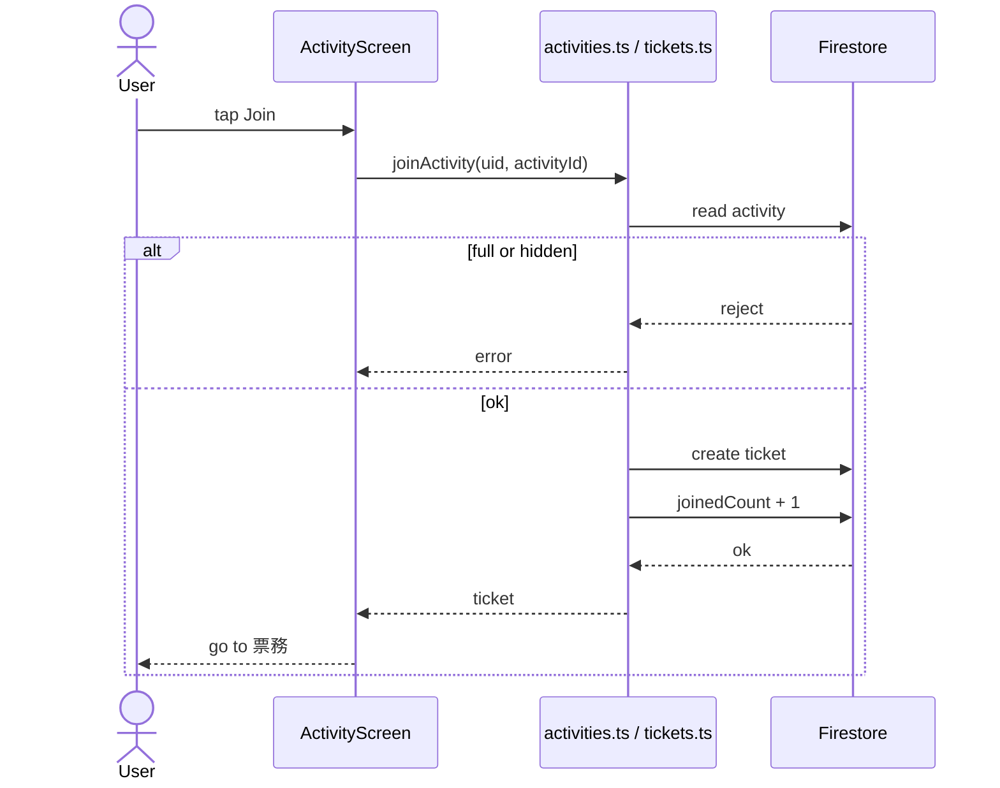

# Thirdspace — one plan (UML, architecture, codebase, MVP)

Planner spec for the **coder**. No app implementation in this repo yet. Frontend reviewer uses **Look** + **MVP screens**.

Build **MVP first**, then the rest of this file. Same app, more files. Not a second product.

---

## 0. Boss papers (must build these jobs)

These three files **are** the brief. Copy them into the project or keep the paths. Implement every **job** below. Do not invent a different app.

| File | What it is |
| --- | --- |
| `C:\Users\reyse\Downloads\thirdspace reference.jpg` | Polished **Home** (normal user Discover). Jobs + layout. **Do not copy the purple look.** |
| `C:\Users\reyse\Downloads\thirdspace wireframe1.jpg` | Paper **flow** — screens and order |
| `C:\Users\reyse\Downloads\thirdspacewireframe2.jpg` | Extra modules: profile, action, personalization, chat |

Boss also said **three roles:** admin, organizers (hosts), normal users.

### 0.1 Pretty Home (`reference.jpg`) — Discover jobs

Normal user only. Hong Kong events.

- Search + greeting (“good evening / where that’s interesting today?”)
- Five shortcuts: Quiet (安靜), Create (創作), Meet people (想識人), This weekend (今個週末), Nearby (附近)
- Popular cards: photo, title, district, date, **HK$ or 免費**
- Featured “new this week” banner
- Recommended cards + **heart** (save)
- Bottom nav on this picture has **five** tabs: Discover (發現), Districts (地區), Saved (收藏), Tickets (票券), Profile (個人檔案)

**Coder rule:** all of those **jobs** must exist in the full app. Saved does **not** need its own tab (heart + list inside Profile). Full-app tabs are **four:** Discover, Districts, Tickets, Profile. See section E.

### 0.2 Paper flow (`wireframe1.jpg`) — screens to build

English meaning of the sketch:

1. **Login** — banner, intro, **email + Google**
2. **Home** — search; **events are the main content, grouped by topic**
3. **Event details** — **Chat** + **Join**, big content area (photo / description)
4. **Host page** (organizer; handwriting 搞手) — host info, a **score** box, **Pass function**
5. **Event review** — Chat + **comment** (after the event)
6. **Footprint + profile** — dashboard + **mission + coupon**
7. **Settings** — “profile” crossed out, replaced with setting, big **?** (boss did not specify fields)
8. **Upcoming events calendar** (日曆)

**Approval** is written then **crossed out.** Do **not** build an approval queue unless product says otherwise. Hosts publish; admin can **hide** later.

**Locked overrides (do not follow the paper blindly):**

- **No host score** (Q24). Host page = name, photo, bio, their events.
- **Pass** = the **ticket card** in My tickets until product says otherwise (Q25 still weakly specified; do not build a second pass system).
- **No cancel / no waitlist in MVP.** Full + Join hidden after start.
- Chat + comments = **ticket holders only** (not in MVP).
- Settings **?** → language, notifications, log out (fill it; do not ship a question mark).

### 0.3 Paper 2 (`wireframe2.jpg`) — extra boxes

| Box on paper | Build as |
| --- | --- |
| User profile: info + follow, stat, interest | Host/user profile. **No vanity stats** required. Follow host. Interests = first-run personalization |
| **Action** (empty) | **Create / edit event** — organizer only |
| **Personalization** (empty) | First-run mood/interests so Recommended works |
| **Chat** (empty) | Thread on the event page, ticket holders only |

### 0.4 Map: paper → screens in this repo

| Boss screen | Coder screen |
| --- | --- |
| Login | `LoginScreen` |
| Home / Discover | `DiscoverScreen` |
| Event details | `ActivityScreen` |
| Host page | `OrganizerScreen` |
| Review / comment | same `ActivityScreen` after end time |
| Tickets tab | `TicketsScreen` |
| Calendar | inside `TicketsScreen` (upcoming) |
| Footprint / mission / coupon | `ProfileScreen` |
| Settings | `SettingsScreen` |
| Action | `CreateActivityScreen` |
| Chat | on `ActivityScreen` |
| Admin (not drawn) | `AdminScreen` |

---

## A. MVP (what “first ship” is)

**MVP = Part 1 only.** If this does not work, stop.

A user can:

1. Open Expo (iOS simulator, Android emulator, or web)
2. Sign up / log in (email + Google)
3. See Discover (活動 list)
4. Open one 活動
5. Tap Join
6. See that ticket under 票務

**In MVP**

- Stack: Expo, React Native, TypeScript, Firebase Auth + Firestore + Storage
- Language: **繁中** only
- Join: no **payment**. Paid events still **show** HK$. Join creates a ticket record
- **Ticket (Q18 A):** 票務 card = title, date/time, address, price/免費, status 已報名. User shows the phone. **No QR**
- **Full / waitlist (Q19):** MVP = 額滿, cannot join. Later = waitlist; cancel frees a spot for the next person
- **Cancel (Q20 C):** No cancel in MVP. Add cancel with waitlist in the full app
- **Late join (Q21 A):** After start time, Join is gone. Past events: comments only
- **Chat (Q22 A):** Only people with a ticket can chat on that event. Not in MVP
- **Comments (Q23 A):** After the event, only people who had a ticket can comment
- **Host score (Q24 C):** No 指數. Host page = name, photo, bio, their events. No stars
- **Pass (Q25 A):** The ticket card is the pass. No second pass on the host page.
- **Stamps (Q27 A):** Full app has a small stamp card on profile (join events → badge). Not in MVP. No real HK$ coupon.
- **Web on laptop (Q28 A):** Same phone screens in Chrome. No separate desktop layout. This is how you test on Windows.
- **Follow (Q29 A):** Following a host puts their new events on your Discover.
- **Heart (Q30 A):** Saves the event. List lives in Profile. Not the same as Join.
- **Report (Q31 A):** Users can report user/host/event. Admin hide/ban. Not in MVP.
- **Notifications (Q32 A):** Push later. Not in MVP.
- **Create form (Q33 A):** photo, title, summary, district+address, date+time, price/free, capacity, mood, event language.
- **Look (Q34 A):** Figma first. Quiet future. Not purple JPEG.
- **Moods + districts (Q35 A):** Moods = Quiet, Create, Meet people, This weekend, Nearby (from boss picture). Districts = fixed HK list (Central, Wan Chai, Causeway Bay, Sheung Wan, Tai Hang, Sham Shui Po, Mong Kok, Tsim Sha Tsui, Kwun Tong, Sai Kung, …). Host picks from the list; free text only for the street address.
- **Firebase (Q36 C):** Coder creates a throwaway Firebase project for the first build. Company/boss project later. Email + Google Auth on that project.
- Seed data: ~8 fake HK 活動 (coder invents titles; HK districts from the list above; mix of 免費 and HK$)
- Screens: Login, Discover, Activity, 票務 (list). Tab bar with 發現 + 票務 working; 地區 + 個人檔案 can be placeholders
- Look detail: quiet future = spacious, one accent, dark or light, big type. **Not purple. Not glass/neon soup.** Figma is the source of truth; boss JPEG = jobs only.

### Frozen so grilling can stop (you said make it)

| Item | Default |
| --- | --- |
| Timezone | Asia/Hong_Kong |
| Tickets | One ticket per user per event |
| App name | Thirdspace |
| Figma | Frontend / you draw screens from this file. Coder may start MVP from this plan + quiet-future tokens if Figma is not ready. Then match Figma when it exists |
| Age / TOS | Not in MVP. Later: 18+ for meeting strangers |
| Analytics / offline / QR / deep links | No until a later part |
| Bundle ID / Apple / Stripe live | Part 4, needs boss accounts |

**Not MVP (still in this plan, later parts)**

- 搞手 create, 搞手 page, chat, comments, 地區, profile, stamps, 3 languages, Stripe, admin, App Store

**活動 fields (Q17 default B)**

Must show: photo, title, district, date/time, price or 免費, short “what we do,” 搞手 name, Join, capacity (e.g. 12/20), meet-up address, event language.

---

## B. Architecture

```
                    ┌─────────────┐
                    │  Expo app   │
                    │ iOS Android │
                    │    Web      │
                    └──────┬──────┘
                           │
              ┌────────────┼────────────┐
              ▼            ▼            ▼
        Firebase Auth  Firestore   Storage
        (email/Google)  (data)     (photos)
              │            │
              │            ▼  later
              │         Stripe (test cards)
              │            │
              └──────── Firebase Cloud Messaging (later)
```

**Layers (coder keeps these separate)**

| Layer | Job | Folder |
| --- | --- | --- |
| UI | Screens, tabs, look | `src/screens`, `src/components`, `src/theme` |
| Navigation | Tabs + stacks | `src/navigation` |
| Domain | Types for User, Activity, Ticket | `src/types` |
| Data | Read/write Firebase | `src/services` |
| i18n | 繁中 / EN / 简体 | `src/i18n` |

**Rules**

- Screens do not talk to Firestore directly. They call `src/services`.
- One theme file. Quiet future tokens. No random purple. Figma is source of look.
- `role` on the user: `user` | `organizer` | `admin`.

**Firebase collections**

```
users/{uid}
  email, displayName, role, interests[], language, createdAt

activities/{id}
  title, photoUrl, district, startsAt, endsAt, priceHkd (0 = 免費),
  summary, address, capacity, joinedCount, eventLanguage,
  mood[], organizerId, status (published | hidden), featured

tickets/{id}
  userId, activityId, status (joined | cancelled), createdAt

messages/{activityId}/items/{messageId}
  userId, text, createdAt          // not MVP

follows/{followerId}_{organizerId}  // not MVP
```

---

## C. UML (English)

**Wireframe (screens, not look)**



Solid path Login → Discover → Event → Tickets = **MVP**.

### C1. Use cases



MVP is only: **Browse, Join, See tickets** (+ login).

### C2. Domain



### C3. MVP sequence (Join)



---

## D. Codebase (folders — coder fills files)

```
thirdspace/
  PLAN.md
  app.json
  package.json
  App.tsx
  src/
    theme/
      colors.ts          # quiet future: surface + one accent, from Figma
      typography.ts      # CJK-safe fonts
      spacing.ts
    types/
      user.ts
      activity.ts
      ticket.ts
    i18n/
      zh-Hant.ts         # MVP
      en.ts              # later
      zh-Hans.ts         # later
    services/
      firebase.ts
      auth.ts
      activities.ts
      tickets.ts
      storage.ts         # later
      chat.ts            # later
      stripe.ts          # later
    navigation/
      RootNavigator.tsx
      TabNavigator.tsx
    components/
      ActivityCard.tsx
      MoodChips.tsx
      PriceText.tsx
      Button.tsx
      EmptyState.tsx
    screens/
      auth/
        LoginScreen.tsx
        InterestsScreen.tsx      # later
      discover/
        DiscoverScreen.tsx
        ActivityScreen.tsx
      districts/
        DistrictsScreen.tsx      # placeholder in MVP
      tickets/
        TicketsScreen.tsx
      profile/
        ProfileScreen.tsx        # placeholder in MVP
        OrganizerScreen.tsx      # later
        SettingsScreen.tsx       # later
      organizer/
        CreateActivityScreen.tsx # later
      admin/
        AdminScreen.tsx          # later
    data/
      seed.ts                    # 8 HK 活動
```

**MVP files that must exist and work**

`LoginScreen` · `DiscoverScreen` · `ActivityScreen` · `TicketsScreen` · `ActivityCard` · `auth.ts` · `activities.ts` · `tickets.ts` · `theme/*`

Everything marked later is empty screen or uncreated file until that part.

---

## E. Rest of the product (after MVP)

Same architecture. Add screens + collections. Do not rewrite.

| Part | Adds |
| --- | --- |
| 2 | Create 活動, 搞手 page, `role` |
| 3 | Chat, comments, 地區, profile, follow, saved, stamps, settings, EN + 简体 |
| 4 | Stripe test cards, admin, EAS / TestFlight |

**Tabs (full app):** 發現 · 地區 · 票務 · 個人檔案

**Look (reviewer, every part):** match Figma (quiet future). Word chips not clip-art circles. Price as type. Big photos. Same system for host/admin. Not purple clone.

---

## F. Who does what

| Terminal | Job |
| --- | --- |
| Planner | This file. No app code. Grilling frozen |
| Coder | Throwaway Firebase + fill `src/` in order: MVP → 2 → 3 → 4 |
| Frontend reviewer | Figma (quiet future) vs app. Discover + Activity first. Not purple clone |
| You | Give this file to the coder. Draw or assign Figma. Company Firebase later |
